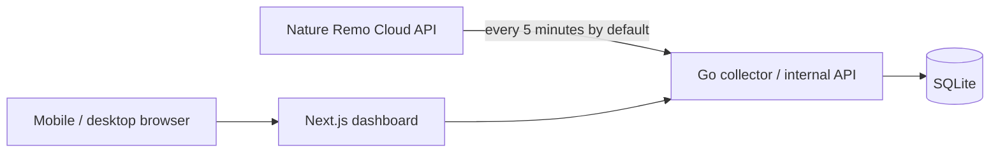

# Ambient Lapis

Nature Remo Lapisで計測した自室の温度・湿度と、Nature Remoが認識するエアコン設定を記録・可視化する、個人用のセルフホスト型ダッシュボードです。

静かで上質な表示体験を重視し、スマートフォンとPCのどちらからでも、現在の室内環境とその変化を自然に把握できるプロダクトを目指します。

## Status

GoバックエンドとNext.jsダッシュボードの初期版実装が完了しています。`backend/`が設定、Nature API収集、SQLite、内部API、バックアップ、Graceful Shutdown、コンテナ運用を担い、`web/`がBFF、契約検証、現在値・履歴・Nature Remo認識状態の表示を担います。

## Architecture



- Goサービスが既定5分間隔でNature Remo Cloud APIから情報を収集します。間隔は`POLL_INTERVAL`で変更できます。
- 温度、湿度、Remoのオンライン状態、エアコンのRemo認識状態をSQLiteへ保存します。
- Next.jsはGoの内部APIからデータを取得し、レスポンシブなWeb UIとして表示します。
- Docker Composeを使用し、Synology NASまたはUbuntu Serverで稼働させます。

## Documents

- [要件メモ](./docs/requirements.md)
- [技術調査・構成メモ](./docs/technical-research.md)
- [システム詳細設計書](./docs/system-design.md)

## Stack

- Next.js / TypeScript
- Go
- SQLite
- Docker Compose
- Apache ECharts

## Project principles

- 個人用途に必要な範囲へ機能を絞る
- データ収集はWeb UIへのアクセスに依存させない
- Nature APIトークンをブラウザへ公開しない
- エアコン状態は「Nature Remo認識状態」として正直に表現する
- 既製の管理画面らしさを避け、余白、文字、色、動きまで丁寧に設計する

## Goバックエンドのローカル実行

前提としてGo 1.26.5を使用します。`.env.example`を参考に、tokenはGit管理外の`secrets/nature_remo_token`へ保存し、実IDは`.env`へ設定してください。

```bash
cd backend
set -a
source ../.env
set +a
export NATURE_REMO_TOKEN_FILE=../secrets/nature_remo_token
export DATABASE_PATH=../data/ambient-lapis.sqlite3
export BACKUP_DIR=../backups
go run ./cmd/ambient-lapis
```

内部APIは既定で`:8080`をlistenします。プロセス生存は`/healthz`、DB・マイグレーション・バックアップ先を含む起動準備は`/readyz`で確認できます。

```bash
cd backend
go run ./cmd/ambient-lapis healthcheck --url http://127.0.0.1:8080/readyz
```

### バックエンド単体Compose

`AMBIENT_LAPIS_DATA_DIR`と`AMBIENT_LAPIS_BACKUP_DIR`は、コンテナUID `10001`が書き込めるローカルファイルシステム上のディレクトリへ設定します。SQLiteをSMB、CIFS、NFS上へ置かないでください。Goの8080番ポートはホストへ公開されません。

```bash
docker compose --env-file .env -f compose.backend.yaml up --build -d
docker compose --env-file .env -f compose.backend.yaml ps
```

起動後はコンテナのhealth statusと構造化ログを確認します。Go APIはホストへ公開しないため、readinessはコンテナ内のhealthcheck CLIで確認します。

```bash
docker compose --env-file .env -f compose.backend.yaml exec remo-api \
  /app/ambient-lapis healthcheck --url http://127.0.0.1:8080/readyz
docker compose --env-file .env -f compose.backend.yaml logs --tail=100 remo-api
```

停止要求後は実行中の収集とHTTPリクエストを完了・キャンセルする猶予として35秒を確保しています。

終了時は次を実行します。データとバックアップはbind mount先に残ります。

```bash
docker compose --env-file .env -f compose.backend.yaml down
```

### バックアップからの復旧

1. Composeを停止する。
2. 現在のDBと同名の`-wal`、`-shm`を退避する。
3. 復旧対象バックアップに対してSQLiteの`PRAGMA integrity_check`が`ok`になることを確認する。
4. 現在のDBを退避してから、バックアップを`DATABASE_PATH`へコピーし、UID `10001`が読み書きできる所有者・権限にする。
5. Goサービスを起動し、`/readyz`と主要APIを確認する。

稼働中のDBファイルを直接コピーしてバックアップや復旧を行わないでください。

### Nature API live smoke

通常の`go test ./...`はNature APIへ接続しません。実機のread-only smokeは明示的に次のコマンドでだけ実行します。`GET /1/devices`と`GET /1/appliances`を各1回呼び、ID、値、生レスポンス、Authorizationは出力しません。

```bash
cd backend
set -a
source ../.env
set +a
export NATURE_REMO_TOKEN_FILE="$(cd .. && pwd)/secrets/nature_remo_token"
LIVE_NATURE_API=1 go test -tags=live -run '^TestLiveNatureAPIReadOnly$' ./internal/nature
```

レート制限の残量が10以下の場合は追加のlive検証を止め、reset時刻以降に再実行してください。CIにはtokenを登録せず、このlive testを通常テストへ含めません。

## Next.jsフロントエンドのローカル実行

Node.js 24.18.0とnpmを使用します。`fnm`を利用する場合は、リポジトリ内のバージョン指定を読み込んでから依存関係をインストールしてください。

```bash
cd web
fnm use 24.18.0
npm install
npm run dev
```

開発サーバーは既定で`http://localhost:3000`に起動します。静的確認、単体テスト、production build、ブラウザE2Eは次の順で実行します。

```bash
cd web
npm run format:check
npm run lint
npm run typecheck
npm test
npm run build
npm run test:e2e
```

PlaywrightのChromiumが未導入の場合は、事前に`npx playwright install chromium`を実行してください。`REMO_API_BASE_URL`はサーバー側だけで使用し、`NEXT_PUBLIC_`変数には設定しません。

`npm run test:e2e`は`127.0.0.1`だけで待ち受ける匿名fixtureのfake Go APIとNext.jsを起動し、390 x 844、768 x 1024、1440 x 900の3構成でSSRとBFFを含む画面を確認します。live Nature APIやローカルのtoken、実IDは使用しません。
