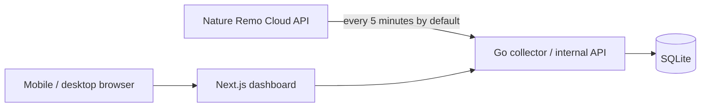

# Ambient Lapis

Nature Remo Lapisで計測した自室の温度・湿度と、Nature Remoが認識するエアコン設定を記録・可視化する、個人用のセルフホスト型ダッシュボードです。

静かで上質な表示体験を重視し、スマートフォンとPCのどちらからでも、現在の室内環境とその変化を自然に把握できるプロダクトを目指します。

## Status

Goバックエンドの初期版実装が完了しています。設定、Nature API収集、SQLite、内部API、バックアップ、Graceful Shutdown、コンテナ運用を`backend/`にまとめています。Next.jsダッシュボードも`web/`で初期版UIまで実装済みです。現在値、エアコンのNature Remo認識状態、EChartsによる履歴グラフ、期間選択、日次サマリー、ライト / ダークテーマ、主要なエラー・警告状態を含みます。

## Architecture



- Goサービスが既定5分間隔でNature Remo Cloud APIから情報を収集します。間隔は`POLL_INTERVAL`で変更できます。
- 温度、湿度、Remoのオンライン状態、エアコンのRemo認識状態をSQLiteへ保存します。
- Next.jsはGoの内部APIからデータを取得し、レスポンシブなWeb UIとして表示します。
- Docker Composeを使用し、Synology NASまたはUbuntu Serverで稼働させます。

## Documents

- [要件メモ](./docs/requirements.md)
- [技術調査・構成メモ](./docs/technical-research.md)
- [システム詳細設計書](./docs/system-design.md)

## Stack

- Next.js / TypeScript
- Go
- SQLite
- Docker Compose
- Apache ECharts（候補）

## Project principles

- 個人用途に必要な範囲へ機能を絞る
- データ収集はWeb UIへのアクセスに依存させない
- Nature APIトークンをブラウザへ公開しない
- エアコン状態は「Nature Remo認識状態」として正直に表現する
- 既製の管理画面らしさを避け、余白、文字、色、動きまで丁寧に設計する

## Next.jsダッシュボードのローカル実行

Node.js 24.18.0とnpmを使用します。主要なnpm scriptは実行時のNode.jsが24.18.0でない場合に停止します。`REMO_API_BASE_URL`はサーバー側だけで使用し、`NEXT_PUBLIC_`変数には設定しません。PlaywrightのChromiumが未導入の場合は、事前に`npx playwright install chromium`を実行してください。

最初にNode.jsを切り替えて依存を導入します。新しいターミナルを開くたびに、npm scriptより先に`fnm use 24.18.0`を実行してください。

```bash
cd web
fnm use 24.18.0
node --version        # v24.18.0
npm ci
```

Goバックエンドへ接続する場合:

```bash
cd web
fnm use 24.18.0
REMO_API_BASE_URL=http://127.0.0.1:8080 npm run dev
```

実バックエンドやNature APIに依存せずUIを確認する場合は、fixtureベースのモックGo APIサーバーを使用します。全データは架空値です。

```bash
cd web
fnm use 24.18.0
npm run mock-api     # 127.0.0.1:8090でモックGo APIを起動
```

別ターミナルでもNode.jsを切り替えてからNext.jsを起動します。

```bash
cd web
fnm use 24.18.0
npm run dev:mock
```

モックのシナリオ(正常、収集停止、Remoオフライン、値未更新、不明、エラーなど)は次で切り替えられます。

```bash
curl -X POST http://127.0.0.1:8090/__scenario -d '{"name":"collectionStopped"}'
curl http://127.0.0.1:8090/__scenario   # 現在のシナリオと一覧
```

検証コマンド:

```bash
cd web
fnm use 24.18.0
npm run check:node
npm run format:check
npm run test:node
npm test
npm run lint
npm run typecheck
npm run build
npm run test:e2e     # Playwright。モックGo API + next devを自動起動
```

Composeを3000番で稼働させたままE2Eを実行する場合は、検証用サーバーを別ポートへ分離できます。

```bash
E2E_WEB_PORT=3001 E2E_MOCK_PORT=8091 npm run test:e2e
```

## Goバックエンドのローカル実行

前提としてGo 1.26.5を使用します。`.env.example`を参考に、tokenはGit管理外の`secrets/nature_remo_token`へ保存し、実IDは`.env`へ設定してください。

```bash
cd backend
set -a
source ../.env
set +a
export NATURE_REMO_TOKEN_FILE=../secrets/nature_remo_token
export DATABASE_PATH=../data/ambient-lapis.sqlite3
export BACKUP_DIR=../backups
go run ./cmd/ambient-lapis
```

内部APIは既定で`:8080`をlistenします。プロセス生存は`/healthz`、DB・マイグレーション・バックアップ先を含む起動準備は`/readyz`で確認できます。

```bash
cd backend
go run ./cmd/ambient-lapis healthcheck --url http://127.0.0.1:8080/readyz
```

## フルスタックComposeのローカル実行

`.env.example`を参考にGit管理外の`.env`を用意し、データ・バックアップ用ディレクトリをコンテナUID `10001`が読み書きできるローカルファイルシステム上へ作成します。SQLiteをSMB、CIFS、NFS上へ置かないでください。次の手順はGoとWebをローカルbuildし、Goの8080番を公開せずWebの3000番だけを公開します。

```bash
docker compose --env-file .env build
docker compose --env-file .env up -d
docker compose --env-file .env ps
docker compose --env-file .env exec remo-api \
  /app/ambient-lapis healthcheck --url http://127.0.0.1:8080/readyz
curl --fail http://127.0.0.1:3000/
docker compose --env-file .env down
```

`AMBIENT_LAPIS_PORT`を変更した場合は、Web確認先の3000番もその値へ読み替えます。Dockerのhealth statusは`/healthz`によるプロセス生存確認であり、デプロイ受け入れでは上記の`/readyz`も必ず確認します。

### バックエンド単体Compose

`compose.backend.yaml`はWebを起動せずGoだけを検証するための補助構成です。通常のフルスタック実行にはルートの`compose.yaml`を使用します。`AMBIENT_LAPIS_DATA_DIR`と`AMBIENT_LAPIS_BACKUP_DIR`は、コンテナUID `10001`が書き込めるローカルファイルシステム上のディレクトリへ設定します。Goの8080番ポートはホストへ公開されません。

```bash
docker compose --env-file .env -f compose.backend.yaml up --build -d
docker compose --env-file .env -f compose.backend.yaml ps
```

起動後はコンテナのhealth statusと構造化ログを確認します。Go APIはホストへ公開しないため、readinessはコンテナ内のhealthcheck CLIで確認します。

```bash
docker compose --env-file .env -f compose.backend.yaml exec remo-api \
  /app/ambient-lapis healthcheck --url http://127.0.0.1:8080/readyz
docker compose --env-file .env -f compose.backend.yaml logs --tail=100 remo-api
```

停止要求後は実行中の収集とHTTPリクエストを完了・キャンセルする猶予として35秒を確保しています。

終了時は次を実行します。データとバックアップはbind mount先に残ります。

```bash
docker compose --env-file .env -f compose.backend.yaml down
```

## ローカル検証とSynology用イメージ

GitHub Actionsや外部レジストリへ依存せず、ローカルで検証したcommitからSynologyへ搬入するイメージを作成します。検証スクリプトはNature APIへ接続せず、Goのfake、Webのfixture、モックAPIを使用します。

```bash
./scripts/verify-local.sh
```

`verify-local.sh`はNode.js 24.18.0のWeb検証、Goのformat・test・race・vet・build、Compose設定確認、コンテナbuildをまとめて実行します。WebのPlaywright E2Eは既定でポート3000/8090を使用します。稼働中のComposeを止めずに静的検証とbuildだけを行う場合は`SKIP_E2E=1 ./scripts/verify-local.sh`を使用し、E2Eは上記の`E2E_WEB_PORT` / `E2E_MOCK_PORT`で別ポートへ分離して実行します。

検証済みのcommitをチェックアウトした状態で、macOS（Apple Siliconを含む）からSynology向け`linux/amd64`イメージをtarへexportします。exportは再現性を保つため、Gitの作業ツリーがcleanであることを要求します。

```bash
./scripts/export-synology-images.sh
```

スクリプトはGit SHAをイメージタグへ使い、`artifacts/ambient-lapis-<sha>-linux-amd64.tar`と対応する`.sha256`を作成します。これらはGit管理外です。tarをSynologyへ安全な経路で搬入し、チェックサム確認後にロードします。

```bash
sha256sum -c ambient-lapis-<sha>-linux-amd64.tar.sha256
docker load -i ambient-lapis-<sha>-linux-amd64.tar
```

`.env`の`APP_VERSION`へtarに含まれる完全なGit SHAを設定し、NAS上ではbuildもレジストリpullも行わず起動します。

```bash
docker compose --env-file .env up -d --no-build
docker compose --env-file .env ps
```

更新時も同じ手順（新しいtarのチェックサム確認、`docker load`、`APP_VERSION`更新、`up -d --no-build`）を繰り返します。Goの8080番はホストへ公開せず、LANへ公開するのはWebの3000番だけです。

### バックアップからの復旧

1. Composeを停止する。
2. 現在のDBと同名の`-wal`、`-shm`を退避する。
3. 復旧対象バックアップに対してSQLiteの`PRAGMA integrity_check`が`ok`になることを確認する。
4. 現在のDBを退避してから、バックアップを`DATABASE_PATH`へコピーし、UID `10001`が読み書きできる所有者・権限にする。
5. Goサービスを起動し、`/readyz`と主要APIを確認する。

稼働中のDBファイルを直接コピーしてバックアップや復旧を行わないでください。

### Nature API live smoke

通常の`go test ./...`はNature APIへ接続しません。実機のread-only smokeは明示的に次のコマンドでだけ実行します。`GET /1/devices`と`GET /1/appliances`を各1回呼び、ID、値、生レスポンス、Authorizationは出力しません。

```bash
cd backend
set -a
source ../.env
set +a
export NATURE_REMO_TOKEN_FILE="$(cd .. && pwd)/secrets/nature_remo_token"
LIVE_NATURE_API=1 go test -tags=live -run '^TestLiveNatureAPIReadOnly$' ./internal/nature
```

レート制限の残量が10以下の場合は追加のlive検証を止め、reset時刻以降に再実行してください。CIにはtokenを登録せず、このlive testを通常テストへ含めません。
