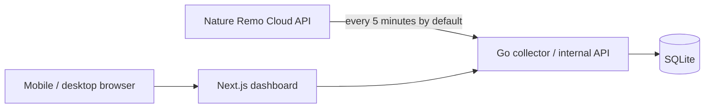

# Ambient Lapis

Nature Remo Lapisで計測した自室の温度・湿度と、Nature Remoが認識するエアコン設定を記録・可視化する、個人用のセルフホスト型ダッシュボードです。

静かで上質な表示体験を重視し、スマートフォンとPCのどちらからでも、現在の室内環境とその変化を自然に把握できるプロダクトを目指します。

## Status

要件定義と技術調査が完了し、実装開始前の段階です。

## Planned architecture

- Goサービスが既定5分間隔でNature Remo Cloud APIから情報を収集します。間隔は`POLL_INTERVAL`で変更できます。
- 温度、湿度、Remoのオンライン状態、エアコンのRemo認識状態をSQLiteへ保存します。
- Next.jsはGoの内部APIからデータを取得し、レスポンシブなWeb UIとして表示します。
- Docker Composeを使用し、Synology NASまたはUbuntu Serverで稼働させます。

## Documents

- [要件メモ](./docs/requirements.md)
- [技術調査・構成メモ](./docs/technical-research.md)
- [システム詳細設計書](./docs/system-design.md)

## Planned stack

- Next.js / TypeScript
- Go
- SQLite
- Docker Compose
- Apache ECharts（候補）

## Project principles

- 個人用途に必要な範囲へ機能を絞る
- データ収集はWeb UIへのアクセスに依存させない
- Nature APIトークンをブラウザへ公開しない
- エアコン状態は「Nature Remo認識状態」として正直に表現する
- 既製の管理画面らしさを避け、余白、文字、色、動きまで丁寧に設計する
