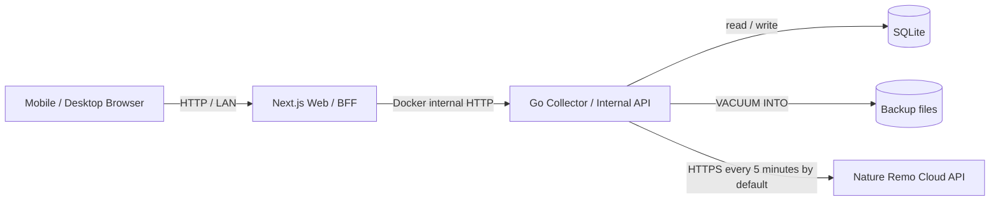
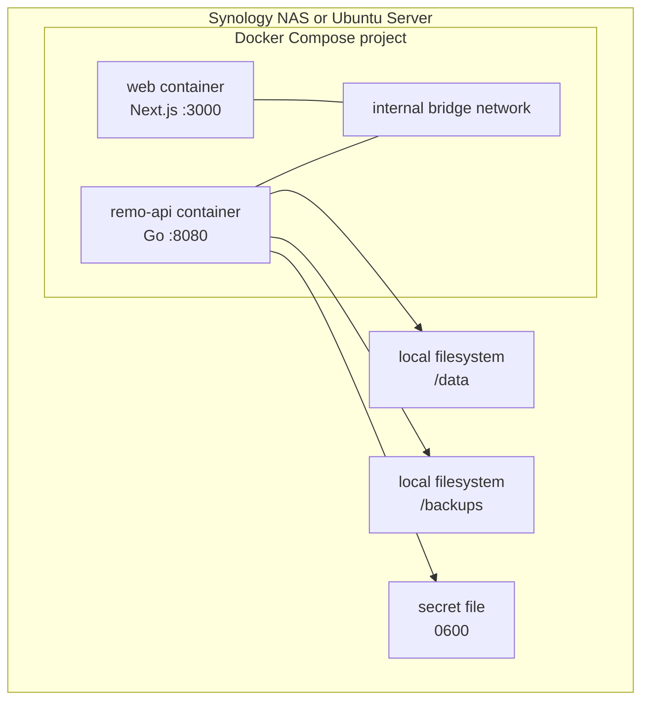
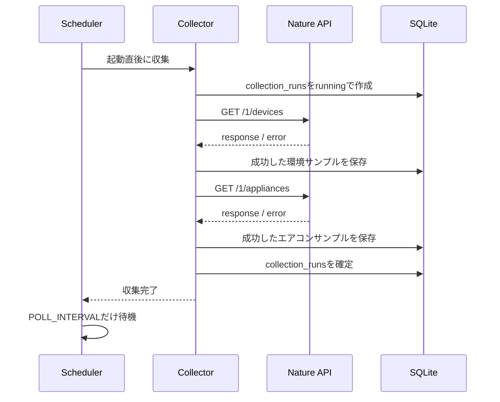

# Ambient Lapis システム詳細設計書

- 作成日: 2026-07-18
- 更新日: 2026-07-19
- ステータス: 初期版実装基準
- 対象リリース: v1
- 関連資料: [要件メモ](./requirements.md) / [技術調査・構成メモ](./technical-research.md)

## 1. 文書の目的

本書は、Nature Remo Lapisから温度・湿度とエアコンのNature Remo認識状態を継続収集し、個人用ダッシュボードとして表示する「Ambient Lapis」の初期版を実装・試験・運用するための詳細設計を定める。

実装時は本書を優先し、本書に記載のない仕様を新たに追加しない。Nature Remo実機の応答を確認しなければ確定できない項目は「検証ゲート」として明示し、実値を推測で埋めない。

### 1.1 対象読者

- 初期実装を担当する開発者
- Docker Compose環境を運用する保守担当者
- 実機PoC後に仕様を更新する担当者

### 1.2 初期版の対象

- Nature Remo Cloud APIからの既定5分間隔の収集（環境変数で変更可能）
- 温度、湿度、Remoオンライン状態の保存と表示
- エアコンのNature Remo認識状態の保存と表示
- 24時間、7日、30日、任意期間の履歴表示
- 日次の温度・湿度の最低、最高、平均
- オフライン、収集停止、古いデータ、欠損の表示
- ライトモード、ダークモードに対応したレスポンシブUI
- SQLiteの永続化、バックアップ、復旧
- Synology NASを主対象とするDocker Compose運用

### 1.3 初期版の対象外

次は実装しない。ただし、収集アダプターやAPIの互換性を壊さず後から追加できる境界は維持する。

- 絶対湿度、露点、不快指数、推定WBGTなどの派生指標
- CSVエクスポート
- 通知、自動化ルール
- Tailscale、VPN、インターネット公開
- Matterによる直接収集
- エアコン操作、実消費電力の計測、実機運転状態の断定
- 複数ユーザー、ログイン、権限管理
- 複数のLapisまたは複数のエアコンの同時管理

### 1.4 前提

- 正式名称は「Ambient Lapis」とする。
- 利用者は1名、対象機器はLapis 1台、エアコン1台とする。
- 初期版は信頼できるLAN内だけで利用し、アプリ独自認証は設けない。
- 対象LapisとエアコンはNature Homeへ登録済みであることを前提とする。
- 表示タイムゾーンは`Asia/Tokyo`、DB内部の時刻はUTC Unix millisecondsとする。
- Nature APIトークン、device ID、appliance IDの実値はGit管理対象へ保存しない。

## 2. 技術基準

初期実装は次のバージョンを基準とし、コンテナイメージ、`go.mod`、`package.json`、ロックファイルで固定する。パッチ更新はテスト通過後に行う。

| 区分 | 採用技術 | 基準バージョン | 用途 |
| --- | --- | --- | --- |
| Backend | Go | 1.26.5 | 収集、SQLite、集計、内部API、バックアップ |
| HTTP | `net/http` | Go標準 | Nature APIクライアント、内部API |
| DBアクセス | `database/sql` | Go標準 | SQLiteアクセス |
| SQLite driver | `modernc.org/sqlite` | 1.53.0 | CGOを使わないSQLite接続 |
| Frontend runtime | Node.js | 24.18.0 LTS | Next.js実行環境 |
| Web framework | Next.js App Router | 16.2.10 | SSR、Route Handler、Web UI |
| Language | TypeScript | Next.js 16.2対応版 | Web UI、API型 |
| Chart | Apache ECharts | 6.1.0 | 温湿度、欠損、エアコン区間の表示 |
| Storage | SQLite | コンテナ同梱版 | 長期履歴の永続化 |
| Runtime | Docker Compose | Compose Specification準拠 | Synology / Ubuntuでの運用 |

バージョン確認元:

- [Go公式ダウンロード](https://go.dev/dl/?mode=html)
- [Node.jsリリース一覧](https://nodejs.org/en/about/previous-releases)
- [Next.js npmパッケージ](https://www.npmjs.com/package/next?activeTab=versions)
- [Apache ECharts Changelog](https://echarts.apache.org/en/changelog.html)
- [modernc.org/sqlite Go Packages](https://pkg.go.dev/modernc.org/sqlite)

## 3. システム構成

### 3.1 論理構成



### 3.2 ネットワーク境界

- LANへ公開するポートはNext.jsの`3000/tcp`だけとする。
- Goサービスの`8080/tcp`はComposeの内部ネットワークだけで使用し、ホストへ`ports`公開しない。
- ブラウザはGoサービスへ直接アクセスしない。
- Next.jsのServer Componentは初期表示時にGo内部APIを直接呼び出す。
- ブラウザからの再取得はNext.js Route Handlerを経由し、同じJSON契約を返す。
- Nature Remo Cloud APIへ接続できるのはGoサービスだけとする。
- SQLiteファイルとバックアップディレクトリをマウントできるのはGoサービスだけとする。

### 3.3 配置構成



Synology NASを第一対象とする。データとバックアップはNAS自身のBtrfsまたはext4上へ置き、SMB、CIFS、NFSマウント上へSQLiteファイルを置かない。Ubuntu Serverでも同じCompose定義を使用し、ホスト側のパスだけを`.env`で変更する。

## 4. コンポーネント責務

### 4.1 Goサービス

- 設定とsecretの検証
- DB接続、PRAGMA適用、マイグレーション
- Nature APIアダプターの生成
- 起動直後および固定遅延による収集
- 応答の検証、対象機器の抽出、正規化
- 収集試行とサンプルのSQLite保存
- 現在値、状態、時系列、日次集計API
- healthcheck、readiness check
- 日次、週次、月次バックアップと世代削除
- JSON構造化ログ
- SIGTERM / SIGINTのGraceful Shutdown

### 4.2 Next.jsサービス

- ダッシュボードのServer-Side Rendering
- Go内部APIのBrowser向け中継
- 60秒ごとの現在値と状態の再取得
- 期間選択に応じた履歴再取得、およびシンプル表示中の5分ごとの履歴更新
- EChartsによる可視化
- 通常表示とシンプル表示の相互導線
- ライト / ダークテーマとレスポンシブUI
- 読み込み、データなし、エラー、オフライン、古いデータの表示

Next.jsはNature API、SQLite、バックアップへ直接アクセスしない。収集ジョブも実行しない。

### 4.3 Nature収集アダプター

Cloud API固有のDTOをドメイン型へ変換する境界を設ける。Go内部では次のインターフェース相当を使用する。

```go
type EnvironmentReading struct {
    DeviceID             string
    Online               *bool
    TemperatureC         *float64
    TemperatureObservedAt *time.Time
    HumidityPct          *float64
    HumidityObservedAt   *time.Time
}

type AirconReading struct {
    ApplianceID          string
    SettingsUpdatedAt    *time.Time
    PowerState           PowerState
    ButtonRaw            string
    ModeRaw              string
    TargetTemperatureRaw *float64
    TemperatureUnitRaw   string
    TargetTemperatureC   *float64
    VolumeRaw            string
    DirectionVerticalRaw string
    DirectionHorizontalRaw string
}

type CollectorAdapter interface {
    FetchEnvironment(ctx context.Context, deviceID string) (EnvironmentReading, error)
    FetchAircon(ctx context.Context, applianceID string) (AirconReading, error)
}
```

将来Matterを採用する場合は`CollectorAdapter`の実装を差し替える。DB、内部API、Web UIの契約は維持する。

## 5. データ収集設計

### 5.1 スケジュール



- 起動直後に1回収集する。
- 1回の収集が完了してから`POLL_INTERVAL`だけ待つ固定遅延方式とする。
- デフォルトは`5m`とし、環境変数`POLL_INTERVAL`で変更可能とする。
- `POLL_INTERVAL`はGoのduration形式で受け付け、最小1分、最大24時間とする。範囲外や不正形式は設定エラーとする。
- 同一プロセス内で収集を並列実行しない。
- `/1/devices`と`/1/appliances`はこの順に呼ぶ。
- 一方が失敗しても他方を呼び出し、成功側のサンプルを保存する。
- プロセス終了要求を受けたら新しい収集を開始せず、実行中リクエストを最大20秒待ってキャンセルする。

### 5.2 対象機器の選択

- `NATURE_REMO_DEVICE_ID`と`NATURE_REMO_APPLIANCE_ID`は必須とする。
- API応答内から設定IDと完全一致する要素だけを選択する。
- 名前、配列順、単一要素であることを利用した自動選択は行わない。
- IDが見つからない場合、そのエンドポイントを`target_not_found`エラーとして記録する。
- ID未設定の場合、サービスはHTTPサーバーを起動するがreadinessを`503`とし、収集を開始しない。
- 正常に解析できたAPI応答内で設定IDが見つからなかった場合は、対象選択を不正としてreadinessを`503`にする。一時的な通信・APIエラーだけでは、それ以前に成功した対象選択状態を変更しない。
- 対象不一致後も設定修正やAPI側の復旧を検出できるよう収集周期で再確認し、正常応答内で対象を確認できた時点でreadinessを回復する。
- IDの実値はログへ出さず、必要な場合は末尾4文字だけをマスク表示する。

### 5.3 HTTPクライアント

| 項目 | 設定 |
| --- | --- |
| Base URL | `https://api.nature.global` |
| 認証 | `Authorization: Bearer {token}` |
| User-Agent | `ambient-lapis/{version}` |
| リクエストタイムアウト | 15秒 |
| 最大レスポンスサイズ | 2 MiB |
| リダイレクト | 同一ホストへのHTTPSのみ、最大3回 |
| 接続再利用 | 有効 |

トークン、Authorizationヘッダー、レスポンス本文全体はログへ出さない。

### 5.4 リトライとエラー分類

| 条件 | 動作 | エラーコード |
| --- | --- | --- |
| 2xxかつ正常JSON | 検証して保存 | なし |
| HTTP 400 / 404 | 同一収集内では再試行しない | `client_error` |
| HTTP 401 / 403 | 同一収集内では再試行しない | `unauthorized` |
| 2xxの正常JSON内に設定IDがない | 保存せず次回収集で再確認する | `target_not_found` |
| 429 | リセット時刻を記録し、同一収集内では再試行しない | `rate_limited` |
| 500〜599 | 5秒、15秒のジッター付き待機後に最大2回再試行 | `upstream_error` |
| タイムアウト / 一時的通信エラー | 5秒後に1回だけ再試行 | `timeout` / `network_error` |
| JSON不正 | 保存せず次回収集へ進む | `invalid_json` |
| 必須構造不正 | 保存せず次回収集へ進む | `schema_mismatch` |
| プロセス終了 | 実行中処理をキャンセル | `cancelled` |

429の待機は`X-Rate-Limit-Reset`が解釈可能な場合に次回収集開始時刻へ反映する。解釈できない場合は`POLL_INTERVAL`を使用する。待機上限は15分とし、これを超える値はログへ警告して15分に丸める。

### 5.5 値の検証と正規化

- 温度と湿度はJSON numberかつ有限値の場合だけ保存する。
- 湿度が0未満または100超の場合はその値だけNULLとし、`value_out_of_range`をログへ記録する。
- 温度が-50℃未満または100℃超の場合はその値だけNULLとし、`value_out_of_range`をログへ記録する。
- `created_at`と`updated_at`が不正な場合は該当時刻をNULLとし、取得値自体は保存できる。
- `settings.button == "power-off"`を`off`、空文字を`on`、それ以外を`unknown`へ正規化する。
- `temp_unit == "c"`はそのまま、`"f"`は摂氏へ変換する。それ以外は摂氏値をNULLとする。
- 未知のモード、風量、風向は破棄せず原値を保存し、Web UIでは「不明」と原値を併記できるようにする。
- レスポンス全体の生JSONはDBへ保存しない。

### 5.6 収集結果

エンドポイントごとの状態は`pending | success | error | skipped`、全体状態は次の規則で決める。

| 全体状態 | 条件 |
| --- | --- |
| `running` | 収集中 |
| `success` | 両エンドポイントが成功し、対象サンプルを保存した |
| `partial` | 片方だけ成功した |
| `error` | 両方失敗した |
| `cancelled` | 終了要求により完了しなかった |

最終完全成功時刻は`collection_runs.overall_status = 'success'`の最新`completed_at`から求める。最終環境取得成功と最終エアコン取得成功は各サンプルの最新`fetched_at`から別に求める。

`collection_runs`の作成、環境サンプルとdevices状態の更新、エアコンサンプルとappliances状態の更新、全体状態の確定は、それぞれ独立した短いトランザクションで実行する。これにより一方の成功を他方の失敗でロールバックしない。起動時に`running`のまま残っている過去runは、前回プロセスが中断したものとして`cancelled`へ更新してから新しい収集を始める。

### 5.7 鮮度判定

判定基準時刻はGoサービスがレスポンスを生成したUTC時刻とする。

| 状態 | 判定 |
| --- | --- |
| 収集正常 | 最終完全成功から`STALE_AFTER`以下 |
| 収集停止 | 最終完全成功がない、または`STALE_AFTER`超 |
| 温度が古い | `temperature_observed_at`がない、または`STALE_AFTER`超 |
| 湿度が古い | `humidity_observed_at`がない、または`STALE_AFTER`超 |
| Remoオフライン | 最新の`device_online = 0` |
| エアコン不明 | 最新の`power_state = unknown`、またはエアコンサンプルがない |

エアコンの`settings_updated_at`は「Nature Remo認識状態が最後に変更された時刻」として表示する。長期間変化しなくても、それだけを理由に状態を古い・不明とは判定しない。収集停止中は最後の状態を残しつつ「最終取得から時間が経過」と警告する。

## 6. SQLite設計

### 6.1 接続とPRAGMA

起動時に次を適用し、取得結果を確認する。

```sql
PRAGMA journal_mode = WAL;
PRAGMA synchronous = NORMAL;
PRAGMA busy_timeout = 5000;
PRAGMA foreign_keys = ON;
```

- 書き込み接続は最大1、読み取り接続を含む接続総数は最大4とする。
- マイグレーションとバックアップ中は収集書き込みを直列化する。
- DBファイルの親ディレクトリが存在しない、書き込めない場合はreadinessを失敗させる。

### 6.2 DDL

```sql
CREATE TABLE schema_migrations (
    version     TEXT PRIMARY KEY,
    checksum    TEXT NOT NULL,
    applied_at  INTEGER NOT NULL
);

CREATE TABLE collection_runs (
    id                       INTEGER PRIMARY KEY,
    started_at               INTEGER NOT NULL,
    completed_at             INTEGER,
    overall_status           TEXT NOT NULL
                             CHECK (overall_status IN
                                 ('running', 'success', 'partial', 'error', 'cancelled')),
    devices_status           TEXT NOT NULL
                             CHECK (devices_status IN
                                 ('pending', 'success', 'error', 'skipped')),
    devices_error_code       TEXT,
    devices_error_detail     TEXT,
    appliances_status        TEXT NOT NULL
                             CHECK (appliances_status IN
                                 ('pending', 'success', 'error', 'skipped')),
    appliances_error_code    TEXT,
    appliances_error_detail  TEXT,
    rate_limit_reset_at      INTEGER,

    CHECK (completed_at IS NULL OR completed_at >= started_at),
    CHECK (
        (overall_status = 'running' AND completed_at IS NULL)
        OR
        (overall_status <> 'running' AND completed_at IS NOT NULL)
    )
);

CREATE INDEX idx_collection_runs_completed
    ON collection_runs(completed_at DESC);

CREATE INDEX idx_collection_runs_status_completed
    ON collection_runs(overall_status, completed_at DESC);

CREATE TABLE environment_samples (
    id                       INTEGER PRIMARY KEY,
    collection_run_id        INTEGER NOT NULL,
    device_id                TEXT NOT NULL,
    fetched_at               INTEGER NOT NULL,
    device_online            INTEGER
                             CHECK (device_online IN (0, 1)),
    temperature_c            REAL,
    temperature_observed_at  INTEGER,
    humidity_pct             REAL
                             CHECK (humidity_pct IS NULL OR
                                    (humidity_pct >= 0 AND humidity_pct <= 100)),
    humidity_observed_at     INTEGER,

    FOREIGN KEY (collection_run_id)
        REFERENCES collection_runs(id) ON DELETE RESTRICT,
    UNIQUE (collection_run_id, device_id)
);

CREATE INDEX idx_environment_samples_device_fetched
    ON environment_samples(device_id, fetched_at DESC);

CREATE INDEX idx_environment_samples_temperature_observed
    ON environment_samples(device_id, temperature_observed_at);

CREATE INDEX idx_environment_samples_humidity_observed
    ON environment_samples(device_id, humidity_observed_at);

CREATE TABLE aircon_samples (
    id                        INTEGER PRIMARY KEY,
    collection_run_id         INTEGER NOT NULL,
    appliance_id              TEXT NOT NULL,
    fetched_at                INTEGER NOT NULL,
    settings_updated_at       INTEGER,
    power_state               TEXT NOT NULL
                              CHECK (power_state IN ('on', 'off', 'unknown')),
    button_raw                TEXT NOT NULL,
    mode_raw                  TEXT,
    target_temperature_raw    REAL,
    temperature_unit_raw      TEXT,
    target_temperature_c      REAL,
    volume_raw                TEXT,
    direction_vertical_raw    TEXT,
    direction_horizontal_raw  TEXT,

    FOREIGN KEY (collection_run_id)
        REFERENCES collection_runs(id) ON DELETE RESTRICT,
    UNIQUE (collection_run_id, appliance_id)
);

CREATE INDEX idx_aircon_samples_appliance_fetched
    ON aircon_samples(appliance_id, fetched_at DESC);

CREATE INDEX idx_aircon_samples_power_fetched
    ON aircon_samples(appliance_id, power_state, fetched_at);
```

### 6.3 NULL方針

- APIに値がない、値が不正、時刻を解釈できない場合は該当列をNULLとする。
- 欠損値を0、直前値、現在時刻で補わない。
- `power_state`だけは必ず`on | off | unknown`へ正規化し、NULLにしない。
- 文字列原値がAPIに存在しない場合はNULL、空文字が意味を持つ`button_raw`は空文字のまま保存する。
- エラー詳細は機密情報を除去し、最大2,048文字に切り詰める。

### 6.4 マイグレーション

- SQLファイルをGoバイナリへembedする。
- ファイル名を`0001_initial.sql`形式とし、ファイル名を`schema_migrations.version`へ保存する。
- SQLファイルのSHA-256を`schema_migrations.checksum`へ保存し、適用済みファイルとの不一致は起動エラーとする。
- 起動時に単一トランザクションで未適用分を昇順適用する。
- 適用済みファイルの内容変更は禁止する。変更は新しいマイグレーションで行う。
- マイグレーション失敗時は収集と業務APIを開始せず、`/healthz`だけを提供し、`/readyz`は`503`とする。

### 6.5 データ保持

- サンプルと収集履歴は初期版では自動削除しない。
- 削除・アーカイブ機能は設けない。
- ディスク使用量はログと運用手順で確認する。
- 将来保持期間を導入する場合も、バックアップ確認後の明示的な管理処理として追加する。

## 7. 時系列・集計設計

### 7.1 解像度の自動選択

`resolution=auto`は`to - from`で次のように決定する。

| 期間 | 解像度 | 最大想定点数 |
| --- | --- | --- |
| 48時間以下 | `raw` | 既定間隔で約576点 |
| 48時間超〜14日以下 | `15m` | 1,344点 |
| 14日超〜90日以下 | `1h` | 2,160点 |
| 90日超〜10年以下 | `1d` | 3,653点程度 |

- 任意期間の最大値は10年とする。
- `raw`を明示した場合は最大48時間、`15m`は14日、`1h`は90日、`1d`は10年とする。
- 最大期間超過は`422 range_too_large`を返し、暗黙に切り詰めない。
- 全時系列APIの返却要素上限は10,000件とする。超過時は`422 result_too_large`を返す。

### 7.2 温湿度時系列

- rawは`fetched_at`を横軸とし、温度・湿度とそれぞれの`observed_at`を返す。
- 同じ`observed_at`が複数回保存されても、収集時点での最新既知値として各raw点を返す。
- 集計はUTC上のバケット境界で行い、日次だけはAsia/Tokyoの暦日境界を用いる。
- バケットごとに平均、最小、最大、サンプル数、最新の計測時刻を返す。
- 値がないバケットも`gap: true`、各統計値NULLの点として返す。
- 隣接する有効サンプルの`fetched_at`差が`STALE_AFTER`を超える場合、その間を欠損とし、グラフ線を接続しない。
- `observed_at`は値が変化しない間に更新されない実機挙動があるため、その経過時間だけで異常判定しない。`STALE_AFTER`は収集停止、有効サンプル間のgap、エアコン区間の有効期限にだけ使用する。
- 各点に`remoOnlineState: online | offline | mixed | unknown`を返す。rawはそのサンプル値、集計はバケット内の状態を集約する。

### 7.3 エアコン区間

- 最新の各サンプルを、その`fetched_at`から次のサンプル直前まで有効なスナップショットとして扱う。
- 区間終了は次のサンプル時刻と`開始 + STALE_AFTER`の早い方とする。
- `STALE_AFTER`を超えて次のサンプルがない部分は`gap`区間とする。
- `unknown`はON/OFFへ推測変換しない。
- レスポンスは`on | off | unknown | gap`の連続区間へ圧縮する。
- モードや設定温度が変化した場合は、電源状態が同じでも区間を分割する。

### 7.4 日次集計

- `Asia/Tokyo`の00:00:00〜翌日00:00:00を1日とする。
- 温度、湿度それぞれの平均、最低、最高、有効サンプル数を計算する。
- 平均は有効な収集サンプルの算術平均とする。
- 1件も有効値がなければ統計値はNULLとする。
- `STALE_AFTER`を超える欠損の累計時間を`gapMinutes`として返す。
- 初期版ではエアコンの運転時間集計を日次集計へ含めない。

## 8. 内部API設計

### 8.1 共通仕様

- Go内部APIとNext.js Route Handlerは同じパスとJSONを使用する。
- Content-Typeは`application/json; charset=utf-8`とする。
- 時刻はAPI上ではUTCのRFC 3339形式で返す。
- JSONフィールド名はcamelCaseとする。
- 成功レスポンスは`data`と`meta`、エラーは`error`と`meta`を持つ。
- リクエストごとに`requestId`を生成し、レスポンスとログへ含める。
- 現在値と状態は`Cache-Control: no-store`とする。
- 履歴と日次集計は`Cache-Control: private, max-age=30`とする。
- ブラウザからのAPIタイムアウトは10秒、Next.jsからGoへのタイムアウトは8秒とする。

成功形式:

```json
{
  "data": {},
  "meta": {
    "requestId": "01J...",
    "generatedAt": "2026-07-18T12:34:56.789Z",
    "timezone": "Asia/Tokyo"
  }
}
```

エラー形式:

```json
{
  "error": {
    "code": "invalid_parameter",
    "message": "from must be earlier than to",
    "field": "from"
  },
  "meta": {
    "requestId": "01J...",
    "generatedAt": "2026-07-18T12:34:56.789Z"
  }
}
```

### 8.2 HTTPステータス

| Status | 用途 |
| --- | --- |
| 200 | 正常。データなしも空配列またはNULLを含む200とする |
| 400 | 必須クエリ欠落、RFC 3339不正、未知の解像度 |
| 404 | 存在しないパス |
| 405 | 許可されないHTTPメソッド |
| 422 | 期間逆転、最大期間・最大件数超過 |
| 500 | DBクエリなど予期しない内部エラー |
| 502 | Next.jsからGoへ接続できない、Goから必要情報を得られない |
| 503 | readiness未達 |

内部エラーの詳細、SQL、パス、トークンはレスポンスへ含めない。

### 8.3 `GET /healthz`

プロセスがHTTPへ応答できることだけを確認する。DB、Nature API、最終収集時刻は判定に含めない。

```json
{
  "status": "ok",
  "version": "0.1.0"
}
```

常にキャッシュ禁止とする。

### 8.4 `GET /readyz`

次をすべて満たす場合だけ200を返す。

- 必須設定が妥当
- secretを読み取り済み
- 対象IDが未設定でなく、正常応答から不一致が確定していない
- DBへ接続可能
- PRAGMAを確認済み
- 全マイグレーション適用済み
- バックアップディレクトリへ書き込み可能

Nature APIの一時障害、Remoオフライン、収集停止はreadiness失敗に含めない。

```json
{
  "status": "ready",
  "checks": {
    "configuration": "ok",
    "targetSelection": "ok",
    "database": "ok",
    "migrations": "ok",
    "backupDirectory": "ok"
  }
}
```

### 8.5 `GET /api/v1/status`

収集基盤の状態を返す。

```json
{
  "data": {
    "collectionState": "healthy",
    "lastFullSuccessAt": "2026-07-18T12:33:00.000Z",
    "lastEnvironmentSuccessAt": "2026-07-18T12:33:00.000Z",
    "lastAirconSuccessAt": "2026-07-18T12:33:01.000Z",
    "lastRun": {
      "startedAt": "2026-07-18T12:33:00.000Z",
      "completedAt": "2026-07-18T12:33:01.200Z",
      "overallStatus": "success",
      "devicesStatus": "success",
      "appliancesStatus": "success",
      "errorCodes": []
    },
    "pollIntervalSeconds": 300,
    "staleAfterSeconds": 600
  },
  "meta": {
    "requestId": "01J...",
    "generatedAt": "2026-07-18T12:34:56.789Z",
    "timezone": "Asia/Tokyo"
  }
}
```

`collectionState`は`initializing | healthy | degraded | stopped`とする。片方の最新取得だけが失敗している場合は`degraded`、最終完全成功から`STALE_AFTER`超は`stopped`とする。

### 8.6 `GET /api/v1/current`

最新環境サンプルと最新エアコンサンプルは別々の収集回から取得してよい。どちらの取得時刻も明示する。

```json
{
  "data": {
    "environment": {
      "fetchedAt": "2026-07-18T12:33:00.000Z",
      "remoOnline": true,
      "temperature": {
        "valueC": 26.4,
        "observedAt": "2026-07-18T12:31:42.000Z"
      },
      "humidity": {
        "valuePct": 58.0,
        "observedAt": "2026-07-18T12:31:45.000Z"
      }
    },
    "aircon": {
      "fetchedAt": "2026-07-18T12:33:01.000Z",
      "recognitionState": "on",
      "mode": {
        "raw": "cool",
        "label": "冷房",
        "known": true
      },
      "targetTemperatureC": 26.0,
      "volume": "auto",
      "directionVertical": "auto",
      "directionHorizontal": null,
      "settingsUpdatedAt": "2026-07-18T11:55:00.000Z"
    },
    "freshness": {
      "collectionStopped": false,
      "lastFullSuccessAt": "2026-07-18T12:33:01.200Z"
    }
  },
  "meta": {
    "requestId": "01J...",
    "generatedAt": "2026-07-18T12:34:56.789Z",
    "timezone": "Asia/Tokyo"
  }
}
```

サンプルがない場合は`environment`または`aircon`をNULLとする。IDの実値は返さない。

### 8.7 `GET /api/v1/environment/series`

必須クエリ:

- `from`: RFC 3339
- `to`: RFC 3339

任意クエリ:

- `resolution`: `auto | raw | 15m | 1h | 1d`。省略時`auto`

```json
{
  "data": {
    "resolution": "15m",
    "points": [
      {
        "time": "2026-07-18T12:00:00.000Z",
        "temperature": {
          "avg": 26.2,
          "min": 26.0,
          "max": 26.4,
          "sampleCount": 5,
          "latestObservedAt": "2026-07-18T12:13:40.000Z"
        },
        "humidity": {
          "avg": 57.6,
          "min": 57.0,
          "max": 58.0,
          "sampleCount": 5,
          "latestObservedAt": "2026-07-18T12:13:42.000Z"
        },
        "remoOnlineState": "online",
        "gap": false
      }
    ]
  },
  "meta": {
    "requestId": "01J...",
    "generatedAt": "2026-07-18T12:34:56.789Z",
    "timezone": "Asia/Tokyo",
    "from": "2026-07-17T12:00:00.000Z",
    "to": "2026-07-18T12:00:00.000Z",
    "limit": 10000,
    "truncated": false
  }
}
```

rawの場合は`temperature`と`humidity`に`value`と`observedAt`を返し、集計統計は返さない。

### 8.8 `GET /api/v1/aircon/series`

`from`と`to`を必須とし、最大期間は10年とする。

```json
{
  "data": {
    "segments": [
      {
        "from": "2026-07-18T12:00:00.000Z",
        "to": "2026-07-18T13:10:00.000Z",
        "state": "on",
        "mode": "cool",
        "targetTemperatureC": 26.0
      },
      {
        "from": "2026-07-18T13:10:00.000Z",
        "to": "2026-07-18T13:22:00.000Z",
        "state": "gap",
        "mode": null,
        "targetTemperatureC": null
      }
    ]
  },
  "meta": {
    "requestId": "01J...",
    "generatedAt": "2026-07-18T13:30:00.000Z",
    "timezone": "Asia/Tokyo",
    "limit": 10000,
    "truncated": false
  }
}
```

### 8.9 `GET /api/v1/daily-summary`

`from`と`to`を必須とし、入力時刻をAsia/Tokyoの日付範囲へ正規化する。最大期間は10年とする。

```json
{
  "data": {
    "days": [
      {
        "date": "2026-07-18",
        "temperature": {
          "avg": 26.3,
          "min": 24.8,
          "max": 28.1,
          "sampleCount": 476
        },
        "humidity": {
          "avg": 57.2,
          "min": 51.0,
          "max": 63.0,
          "sampleCount": 476
        },
        "gapMinutes": 12
      }
    ]
  },
  "meta": {
    "requestId": "01J...",
    "generatedAt": "2026-07-19T00:05:00.000Z",
    "timezone": "Asia/Tokyo",
    "limit": 10000,
    "truncated": false
  }
}
```

## 9. Web UI設計

### 9.1 ルートとデータ取得

| パス | 用途 |
| --- | --- |
| `/` | 通常ダッシュボード |
| `/simple` | グラフを主役にした1画面シンプル表示 |
| `/api/v1/status` | Go APIの同一契約を中継 |
| `/api/v1/current` | Go APIの同一契約を中継 |
| `/api/v1/environment/series` | Go APIの同一契約を中継 |
| `/api/v1/aircon/series` | Go APIの同一契約を中継 |
| `/api/v1/daily-summary` | Go APIの同一契約を中継 |

- 初期表示はServer Componentで`status`、`current`、直近24時間の各series、当日を含む7日分の日次集計を取得する。
- `/simple`の初期表示はServer Componentで`status`、`current`、直近24時間の各seriesだけを取得し、日次集計は取得しない。
- 初期API取得に失敗してもページシェルを返し、エラー状態からクライアント再取得できるようにする。
- ブラウザ表示中だけ`status`と`current`を60秒間隔で再取得する。
- タブが非表示の間は定期取得を停止し、表示復帰時に即時再取得する。
- 通常表示の履歴は期間選択時だけ再取得する。シンプル表示の履歴は期間選択時に加え、表示中だけ5分間隔で期間終端を現在時刻へ進めて再取得し、表示復帰時にも即時再取得する。
- 現在値・履歴とも、次の取得を開始するときは同じ用途の進行中リクエストをキャンセルする。シンプル表示の更新失敗時は直前に取得できた表示値を保持する。
- Route Handlerはクエリを許可リストで検証し、Go APIへそのまま中継する。任意URLへのプロキシにはしない。

### 9.2 情報構造

PC（幅900px以上）:

1. ヘッダー(ワードマーク、当日日付、テーマ切替)
2. ステータス行(収集状態+最終取得。異常時は警告行を追加)
3. 「現在」の見開き: 左2/3に温度・湿度のヒーロー数値と今日の最低/最高、右1/3にヘアライン左罫のエアコン欄(Nature Remo認識状態)
4. 期間フィルタ行(履歴と日別記録の両方をスコープ)
5. 履歴ブロック(温度パネル+湿度パネル+エアコン状態リボン+テキスト要約)
6. 日別記録(レンジバーの行組み)
7. データの注記

幅900px未満(モバイル・タブレット)は同じ順序の完全な縦一列とし、エアコン欄は全幅ヘアラインの下に置く。ヒーローの温度・湿度は縦に積む。

シンプル表示は通常表示の情報構造を流用せず、`100dvh`の単一面に次を重ねる。

1. ビューポート全面の温度・湿度グラフとエアコン認識リボン
2. 上部の現在温度・湿度
3. 反対側のエアコンNature Remo認識状態、モード、認識設定温度
4. 下部の選択時刻の詳細、履歴更新エラー、収集停止・Remoオフラインなどの重大警告（該当時）
5. Ambient Lapisヘッダー右側に操作時だけ現れるフラットな操作menu（`24h / 7d / 30d`、テーマpopmenu、全画面・通常表示アイコン）

操作menuは面・ステータス行・罫線・角丸を持たず、ヘッダー右寄せを基本とする。390px前後のモバイルではbrandを隠して同じヘッダー行をmenuへ譲り、タブレット以上ではbrandとmenuを左右に同時表示する。初期状態では表示せず、シンプル面へのマウス移動・タッチ・キーボード操作で表示する。3秒間操作がなければ自動的に隠し、menuのhover / focus中は表示を維持する。`Escape`で即時に閉じられる。テーマ操作はライト / ダーク / 自動の3択popmenuとし、矢印キーで選択を移動できる。選択時刻の詳細パネル、履歴更新エラー、収集停止・Remoオフラインなどの重大警告はmenuとは分離し、menuの表示状態にかかわらず常時確認できる位置へ置く。

シンプル表示はPC、タブレット、モバイルのすべてで縦横スクロールを発生させない。モバイルではオーバーレイを上下へ再配置し、グラフの描画安全余白を連動させる。風量・風向、日次サマリー、任意期間入力、長い注記はシンプル表示へ表示せず、必要な場合は通常表示で確認する。

### 9.3 現在値

- 温度と湿度をページで最も大きい数値として表示する。
- 温度は小数1桁と`°C`、湿度は整数と`%`を基本とする。
- 値の直下に計測時刻を日本時間で表示する。
- 収集時刻と計測時刻を混同しない。詳細表示では両方を示す。
- 計測時刻が更新されていなくても、収集成功が継続している場合は通常表示とし、計測時刻だけを中立色で示す。
- Remoオフライン時も最後の値を残し、「現在値ではない可能性があります」と明記する。

### 9.4 エアコン表示

- 見出しは常に「エアコン - Nature Remo認識状態」とする。
- `on`は「運転中」、`off`は「停止」、`unknown`は「不明」と表示する。
- モード、設定温度、風量、上下風向、左右風向、状態変更時刻を表示する。
- NULLや未対応値を`0`や`自動`へ補わず、「--」または「不明」と表示する。
- 「エアコン本体との双方向確認ではありません」という注記を常時確認できる位置に置く。
- 収集停止時は最後の認識状態を表示したまま、取得時刻と警告を追加する。

### 9.5 履歴グラフ

- EChartsはクライアントコンポーネントで遅延読み込みする。
- 二軸コンボ(温度=左軸、湿度=右軸)は2つのスケールの整列が恣意的で相関を誤読させるため採用しない。温度パネル(大)と湿度パネル(小)を上下に積み、各パネルは単一のY軸を持つ。X軸(時間)は全パネルで共有し、明示的な`min`/`max`(選択期間)で固定する。
- 湿度パネルのY軸はデータ範囲を10%単位へ丸めた範囲とし、0〜100%へ圧縮しない。
- 湿度パネルの下に高さ約18pxの「エアコン認識リボン」を置く。`on`と`unknown`区間だけを塗り、`off`と`gap`は空白とする。リボンの凡例(運転中 / 不明 / 空白の意味)をテキストで併記する。
- 線は2px、面は系列色の10%ワッシュ。データ欠損はNULL点で線を切り、`connectNulls`を無効にする。同じ値が継続するサンプルは通常の水平線として描き、計測時刻の経過をwarning色の点で表現しない。
- 温度パネルには運転認識中かつ設定温度が数値の区間だけ、「Nature Remo認識設定温度」を室温と同じY軸へ細い低コントラストの破線で重ねる。停止、不明、gap、NULLでは線を切り、保持設定を運転中として補完しない。
- クロスヘアは全パネル連動(`axisPointer.link`)とし、1つの選択詳細に日本時間、温度、湿度、各計測時刻、Remoオンライン状態、エアコン認識状態、認識設定温度、室温との差を表示する。
- シンプルvariantでは全端末でEChartsの浮動tooltip本文を表示しない。軸ポインタ（クロスヘア）と画面下部の選択値表示は維持し、マウスhover / タッチtap / キーボード選択で同じ詳細パネルを更新する。グラフ外tapで選択を解除する。
- 通常表示variantでは従来どおりマウスhover、タッチtapの浮動tooltipを使用する。
- ズームは`inside` dataZoom(全パネル連動)とし、タッチはピンチのみ有効にする。1本指の横パンは縦スクロールを奪うため無効とし、期間の変更はフィルタ行を主とする。dataZoomスライダーは表示しない。
- 期間選択は`24時間 | 7日 | 30日 | 任意`とする。
- 任意期間は開始日と終了日を選択し、未来時刻を終了に指定できないようにする。

### 9.6 日次サマリー

- 日次サマリーの対象範囲は履歴の期間選択に連動する。ただし24時間プリセットでは1日分のサマリーに意味がないため、当日を含む直近7日分を表示する。
- 各日の統計と`gapMinutes`は、その暦日とAPIの`from`〜`to`が重なる時間だけを対象とする。当日は`to`までとし、未来時間を欠損へ含めない。
- 新しい日付を先頭にしたリストとする。
- 日付、温度の最低 / 平均 / 最高、湿度の最低 / 平均 / 最高を表示する。
- 欠損がある日は警告アイコンと欠損時間を表示し、バーを減光する。データが皆無の日はem-dashで「不在」を示し、行を省略しない。
- 表現は1日1行のレンジバーとする: 温度・湿度それぞれ最低→最高のバー、平均は金のティック。表示中の全日で共有するスケール(温度5°単位、湿度10%単位へ丸め)を用い、リスト頭に目盛りルーラーを1本置く。数値(最低/平均/最高、tabular)を行末に併記する。
- PCは温度と湿度を2カラムの行、モバイルは日付の下へ温度バー・湿度バーを積み、数値は最低–最高へ簡約する。7行ごとに強めのヘアラインで週を区切り、月が変わる位置に月ラベルを置く。

### 9.7 シンプル表示

- `/`と`/simple`の双方に相互リンクを置く。通常表示ヘッダーのリンクは「シンプル表示」、シンプル表示menuのリンクは「通常表示」とし、ブラウザタブのタイトルは`Ambient Lapis — Simple`とする。名称変更前の旧ルートはリダイレクトせず廃止する。シンプル表示を開くたび期間は直近24時間から開始し、期間選択は永続化しない。テーマの保存規則は通常表示と共有する。
- グラフコンポーネントへ`simple`表示variantを設け、温度パネルを主、湿度パネルを従とする上下独立スケールをビューポート全面へ置く。温度面へNature Remo認識設定温度の破線、下端へエアコン認識リボンを重ね、通常表示と同じNULL・gap・unknownの正直な表現を維持する。
- グラフは選択変更を`onSelectionChange(EnvironmentChartSelection | null)`相当でシンプル表示へ通知する。選択時刻は全パネル連動クロスヘアで示し、日本時間、温度、湿度、Remoオンライン状態、エアコン認識状態、認識設定温度、室温との差を下部の簡潔な詳細パネルへ表示する。温度・湿度には`--temperature` / `--humidity`の色キードットを付け、ダッシュボードtooltipと同じ視覚キーとする。エアコン認識が運転中かつモードがある場合は`運転中・冷房`のようにモードを併記する。エアコン認識セグメントのgapは`データなし`、選択ポイントがgapの場合は温度・湿度の代わりに`データなし(欠損)`を1つだけ表示し、いずれもダッシュボードtooltipと同じ文言で正直に表現する。
- fine pointerではhover中だけ下部の選択詳細を表示し、グラフ外へ出たときに閉じる。coarse pointerではtapした選択を固定し、外側tapまたは閉じる操作で解除する。キーボードでは`role="img"`のグラフへフォーカスした後、左右矢印キーで有効な時系列点を移動する。シンプル表示ではこれらの操作中も浮動tooltipを生成しない。
- 詳細パネルの値はtabular-numsの単一行とし、高さは約62pxに抑える。Remo、エアコン認識、設定、室温差の任意項目はviewport幅820px未満で非表示とし、768pxのタブレットでは時刻・温度・湿度・閉じるだけを表示する。
- グラフ配置は`computeSimplePanelLayout`が画面下端の帯を確保する(`bottom`はviewport幅600px以上で128px、未満で160px)。エアコン認識リボンの下端はviewport下端−帯の高さとし、共有時間軸ラベルはこの帯の上部へ描く。選択詳細パネルはラベル帯より下へ配置し、軸ラベルを決して覆わない。
- 通常時の補助情報は短いラベルへ抑える。エアコン表示には常に「Remo認識」を含め、実機との双方向確認ではないことを長文注記なしで示す。
- 収集停止・Remoオフラインでは現在値をsecondary色へ減光し、ページ天のdangerルールと短い状態文を表示する。データなし・履歴エラーでは値を補完せず、グラフ中央へ簡潔な空状態と再試行操作を表示する。部分成功とunknownも正常表示へ偽装しない。
- Fullscreen APIは利用者が全画面操作を選んだときだけ呼ぶ。`document.fullscreenEnabled`がfalse、またはAPIが存在しない環境では全画面操作を表示しない。全画面化の拒否・失敗で画面全体をエラー状態へ変えない。
- Wake Lock、画面自動回転、スライドショー、エアコン操作はシンプル表示の責務に含めない。

## 10. ビジュアルデザイン

コンセプト名は「観測手帳(Observatory Folio)」とする。部屋の空気を毎日眺めるための、組版された観測記録として設計する。カード・ボーダー・影・角丸の組合せを使わず、テーマごとに単一の連続した面の上を余白と1pxヘアラインだけで区切る。ダーク=ラピスラズリの原石(群青の夜)、ライト=紙に引いた群青の顔料(温かい紙×藍インク)という対とし、両テーマは構図・タイポグラフィ・グリッドを完全に共有して素材だけを替える。

### 10.1 カラートークン

系列2色はdataviz検証(明度帯・彩度床・CVD分離・表面コントラスト)に合格した値、テキスト・状態色はすべて表面に対して4.5:1以上を確認した値とする。

| Token | Light(紙) | Dark(群青) | 用途 |
| --- | --- | --- | --- |
| `--canvas` | `#F7F6F2` | `#0F182E` | 唯一の面 |
| `--ink` | `#1C2A45` | `#E8ECF5` | 本文、主要数値 |
| `--ink-secondary` | `#56617A` | `#94A0B8` | 補助文、danger時の減光ヒーロー |
| `--ink-muted` | `#64708A` | `#7C8AA8` | ラベル、軸 |
| `--hairline` | `#E4E1D8` | rgba(232,236,245,.12) | 罫線 |
| `--hairline-strong` | `#CFCCC0` | rgba(232,236,245,.24) | 週区切り等の強い罫線 |
| `--raised` | `#FDFCF8` | `#1A2440` | ツールチップのみ |
| `--temperature` | `#C2503C` | `#D67350` | 温度系列(ページ唯一の暖色) |
| `--humidity` | `#3D63C0` | `#6089DE` | 湿度系列(ラピス青はデータの色) |
| `--gold` | `#8A6D2F` | `#C9A961` | 署名アクセント: フォーカスリング、日次平均ティック、正常時のステータスドット、ワードマークの粒 |
| `--danger` | `#AE402D` | `#F49084` | 収集停止、オフライン(常にアイコン+文字併用) |
| `--warning` | `#8A5D10` | `#E3B466` | 部分障害、不明 |
| `--success` | `#206B4E` | `#6CC5A0` | (予備)正常表示 |
| `--ribbon-on` | inkの18%ワッシュ | secondaryの30%ワッシュ | エアコンONリボン |
| `--ribbon-unknown` | warning系の22%ワッシュ | warning系の24%ワッシュ | 不明リボン |

警告や系列の識別を色だけに依存させない。選択状態(期間タブ、テーマ切替)はインク色の2px下線で示す。

### 10.2 タイポグラフィ

- フォントは`system-ui, -apple-system, BlinkMacSystemFont, "Segoe UI", sans-serif`のみとし、装飾書体・英字飾りラベルを使わない。
- ヒーロー数値は「計器の読み取り」として組む: 左寄せ、整数部`clamp(4rem, 11vw, 7rem)` weight 300、小数部と単位は約0.5em・weight 400・secondary色でベースライン揃え。数字のみ`letter-spacing -0.025em`、和文に負の字間は使わない。proportional figuresとし、ヒーローにtabular-numsを使わない。
- 湿度はヒーローの約45%サイズの従とする。
- セクションラベルは簡潔な和文2〜4文字(「現在」「推移」「日別記録」「期間」)、0.75rem、weight 500、`letter-spacing 0.1em`、muted色。
- 本文: 0.9375rem、line-height 1.7。補助文: 0.8125rem。
- `tabular-nums`は縦に揃う数値列(日別記録の数値、dl値、軸ラベル)に限定する。

### 10.3 空間・形状

| 項目 | 値 |
| --- | --- |
| ページ最大幅 | 1160px |
| 左右余白 | 20 / 32 / 48px(モバイル / sm / lg) |
| セクション間隔 | 48px、8pxリズム |
| 区切り | 1px `--hairline`(カード・影・角丸の箱は使わない) |
| 最小タップ領域 | 44 x 44px |
| 日別記録の行高 | 32px(バー6px、平均ティック2x14px) |

影・ガラス表現・グラデーション装飾は使用しない。ツールチップのみ`--raised`面+ヘアライン枠を許可する。

### 10.4 動き

- 通常の状態変化は150〜220ms、`ease-out`とする。
- ページ全体の登場アニメーションは行わない。
- `prefers-reduced-motion: reduce`ではトランジションとグラフアニメーションを無効にする。

### 10.5 フォーカスとキーボード

- 操作可能要素に2pxの`--gold`フォーカスリングと3pxのoffsetを付ける。
- 通常表示の期間選択とテーマ切替は矢印キーとEnter / Spaceで操作できる(radiogroup+roving tabindex)。シンプル表示のテーマは3択popmenuとして開閉し、menu項目を矢印キーで移動、`Escape`で閉じられる。
- 日付入力、テーマ切替、グラフの代替情報へTabで到達できる。
- グラフには期間内の最低、最高、最新値を含むテキスト要約を付け、日次レンジバーには数値ラベルを併記する。

## 11. UI状態設計

| 状態 | 表示 | 再試行 |
| --- | --- | --- |
| 初回読み込み | 中立な骨格のみ。数値を偽表示しない | 自動 |
| データなし | 「収集データはまだありません」と初回収集待ちを表示 | 60秒ごと |
| 現在値APIエラー | ヒーロー領域内にエラー行と再試行。履歴があれば残す | 手動 + 60秒ごと |
| 履歴APIエラー | 履歴ブロック内だけにエラーを表示 | 手動 |
| 部分成功 | 取得できた領域は表示し、失敗領域だけ警告 | 自動 |
| 収集停止 | 多層のdanger表現(下記) | 自動 |
| Remoオフライン | 多層のdanger表現+ヒーロー直下に注記 | 自動 |
| 温度 / 湿度の計測時刻が未更新 | 通常表示のまま計測時刻を中立色で表示 | 自動 |
| エアコン不明 | 「不明」+警告行。ON/OFFへ推測しない | 自動 |
| 欠損 | グラフ線を切り、日次行へ欠測時間を表示 | 期間変更時 |

通常表示の警告は「定位置のステータス行」を核とする。ステータス行はヘッダー直下に常在し(`● 収集正常 ・ 最終取得 N分前`、正常時は金のドット)、異常時は同じ位置で色・文言・weightが変わる。追加の警告はアイコン+着色テキストの薄い行としてヘアラインで積む。シンプル表示のフラット操作menuにはステータス行を置かず、重大警告は独立した常時可視領域へ置く。

danger状態(収集停止、Remoオフライン)はさらに次を重ねる: (a)ヒーロー数値をsecondary色へ減光し、最終観測時刻を明示する(画面が静かになることが第一の警告)、(b)ページ天に2pxのdangerルール、(c)`document.title`へ「⚠」接頭辞。ステータス行の`role`は通常`status`、danger時は`alert`とする。

警告の優先順位は`収集停止 > Remoオフライン > 部分成功 > エアコン不明`とする。上部は要約、対象値の直下に詳細を置き、同じ原因を長文で重複させない。

## 12. 設定設計

### 12.1 Goサービス

| 変数 | 必須 | デフォルト | 内容 |
| --- | --- | --- | --- |
| `NATURE_REMO_TOKEN_FILE` | 条件付き | なし | 本番用tokenファイル |
| `NATURE_REMO_TOKEN` | 条件付き | なし | ローカル開発用。token fileと同時指定不可 |
| `NATURE_REMO_DEVICE_ID` | 必須 | なし | 対象Lapis ID |
| `NATURE_REMO_APPLIANCE_ID` | 必須 | なし | 対象エアコンID |
| `DATABASE_PATH` | 任意 | `/data/ambient-lapis.sqlite3` | SQLiteパス |
| `BACKUP_DIR` | 任意 | `/backups` | バックアップ先 |
| `POLL_INTERVAL` | 任意 | `5m` | 収集完了後の待機時間。最小1分、最大24時間 |
| `HTTP_TIMEOUT` | 任意 | `15s` | Nature API timeout。最大60秒 |
| `STALE_AFTER` | 任意 | `max(10m, 2 × POLL_INTERVAL)` | 収集停止・計測値が古い判定。明示時はPOLL_INTERVALの2倍以上 |
| `LISTEN_ADDR` | 任意 | `:8080` | 内部HTTP listen address |
| `LOG_LEVEL` | 任意 | `info` | `debug | info | warn | error` |
| `TZ` | 任意 | `Asia/Tokyo` | バックアップと日次集計のタイムゾーン |

`NATURE_REMO_TOKEN_FILE`と`NATURE_REMO_TOKEN`はどちらか一方だけ必須とする。本番Composeではtoken fileだけを使う。値の前後空白と改行を除去し、空文字は設定エラーとする。

### 12.2 Next.jsサービス

| 変数 | 必須 | デフォルト | 内容 |
| --- | --- | --- | --- |
| `REMO_API_BASE_URL` | 必須 | なし | `http://remo-api:8080` |
| `PORT` | 任意 | `3000` | Web listen port |
| `HOSTNAME` | 任意 | `0.0.0.0` | Web listen address |
| `TZ` | 任意 | `Asia/Tokyo` | SSR表示タイムゾーン |

`REMO_API_BASE_URL`はサーバー側だけで使用し、`NEXT_PUBLIC_`変数へ設定しない。

## 13. Docker Compose設計

```yaml
services:
  remo-api:
    build:
      context: .
      dockerfile: backend/Dockerfile
    image: ambient-lapis-api:${APP_VERSION:-local}
    restart: unless-stopped
    stop_grace_period: 35s
    environment:
      NATURE_REMO_TOKEN_FILE: /run/secrets/nature_remo_token
      NATURE_REMO_DEVICE_ID: ${NATURE_REMO_DEVICE_ID}
      NATURE_REMO_APPLIANCE_ID: ${NATURE_REMO_APPLIANCE_ID}
      DATABASE_PATH: /data/ambient-lapis.sqlite3
      BACKUP_DIR: /backups
      POLL_INTERVAL: ${POLL_INTERVAL:-5m}
      HTTP_TIMEOUT: ${HTTP_TIMEOUT:-15s}
      STALE_AFTER: ${STALE_AFTER:-}
      LISTEN_ADDR: :8080
      LOG_LEVEL: ${LOG_LEVEL:-info}
      TZ: Asia/Tokyo
    secrets:
      - nature_remo_token
    volumes:
      - type: bind
        source: ${AMBIENT_LAPIS_DATA_DIR:?AMBIENT_LAPIS_DATA_DIR is required}
        target: /data
      - type: bind
        source: ${AMBIENT_LAPIS_BACKUP_DIR:?AMBIENT_LAPIS_BACKUP_DIR is required}
        target: /backups
    healthcheck:
      test: ["CMD", "/app/ambient-lapis", "healthcheck", "--url", "http://127.0.0.1:8080/healthz"]
      interval: 30s
      timeout: 5s
      retries: 3
      start_period: 10s
    read_only: true
    tmpfs:
      - /tmp:size=16m,mode=1777
    security_opt:
      - no-new-privileges:true
    networks:
      - internal

  web:
    build:
      context: .
      dockerfile: web/Dockerfile
    image: ambient-lapis-web:${APP_VERSION:-local}
    restart: unless-stopped
    init: true
    environment:
      REMO_API_BASE_URL: http://remo-api:8080
      HOSTNAME: 0.0.0.0
      PORT: 3000
      TZ: Asia/Tokyo
    depends_on:
      remo-api:
        condition: service_started
    ports:
      - "${AMBIENT_LAPIS_PORT:-3000}:3000"
    healthcheck:
      test:
        [
          "CMD",
          "node",
          "-e",
          "const socket=require('node:net').connect(3000,'127.0.0.1');socket.setTimeout(4000);socket.on('connect',()=>{socket.end();process.exit(0)});socket.on('timeout',()=>process.exit(1));socket.on('error',()=>process.exit(1))",
        ]
      interval: 30s
      timeout: 5s
      retries: 3
      start_period: 20s
    read_only: true
    tmpfs:
      - /tmp:size=16m,mode=1777
      - /app/.next/cache:size=64m,uid=10001,gid=10001,mode=0700
    security_opt:
      - no-new-privileges:true
    networks:
      - internal

networks:
  internal:
    driver: bridge

secrets:
  nature_remo_token:
    file: ./secrets/nature_remo_token
```

- ローカルでは`build`を使用し、`APP_VERSION`未指定時は`local`タグとする。Synologyへ搬入する場合は、検証済みcommitの完全なGit SHAを`APP_VERSION`へ設定し、同じSHAを付けた`ambient-lapis-api`と`ambient-lapis-web`の`linux/amd64`イメージをMac上でbuildしてtarへexportする。`latest`や外部レジストリは使用しない。
- `scripts/verify-local.sh`でNature APIへ接続しないローカル検証（Go、Web、Compose、コンテナbuild）を実行し、`scripts/export-synology-images.sh`でcleanなGit作業ツリーから`artifacts/ambient-lapis-<sha>-linux-amd64.tar`とSHA-256チェックサムを作成する。tarは安全な経路でSynologyへ搬入し、`docker load`でロードする。
- GoのDocker healthcheckはプロセス生存を表す`/healthz`を使用する。設定、DB、マイグレーション、バックアップ先を含む`/readyz`はデプロイ後の運用受け入れで別途確認し、Dockerの再起動判定には使用しない。
- WebはGoのreadinessに関係なくエラーシェルと再試行導線を返せるため、依存条件を`service_started`とする。Goが起動中でreadiness未達の場合は、Goの正規error envelopeとHTTP 503をBFFが維持する。Go停止、接続不能、timeout、設定欠落、契約外レスポンスの場合だけ、秘密情報を含まない502へ変換する。
- 両コンテナは非rootイメージ、read-only root filesystem、`no-new-privileges`を使用する。書き込みはGoのDB・バックアップbind mountと、各コンテナの一時`tmpfs`だけへ限定する。Webの`/app/.next/cache`も永続化せずtmpfsとする。
- GoとWebはinternal networkで接続し、Goの8080番をホストへ公開しない。LANへ公開するのはWebの3000番だけとする。

### 13.1 Synology

- Container ManagerでCompose projectとして起動する。Actionsや外部レジストリを使わず、Macから搬入したtarをローカルイメージとして使用する。
- `AMBIENT_LAPIS_DATA_DIR`と`AMBIENT_LAPIS_BACKUP_DIR`はNASローカルボリューム上の絶対パスとする。
- プロジェクトを実行するユーザーだけがsecretファイルを読めるようにする。
- Macで作成した`ambient-lapis-<sha>-linux-amd64.tar`と`.sha256`を搬入し、`sha256sum -c ambient-lapis-<sha>-linux-amd64.tar.sha256`で検証してから`docker load -i ambient-lapis-<sha>-linux-amd64.tar`を実行する。`.env`の`APP_VERSION`へtarに含まれる完全なGit SHAを設定し、`docker compose --env-file .env up -d --no-build`で起動する。`--no-build`を必須とし、NAS上ではbuildもpullも行わない。
- Container ManagerのCompose実装が`depends_on.condition`へ非対応の場合でも、Web側はGo API未準備を503として扱って起動継続できるようにする。

### 13.2 Ubuntu Server

- Docker EngineとCompose pluginを使用する。
- データパス例は`/srv/ambient-lapis/data`、バックアップは`/srv/ambient-lapis/backups`とする。
- ディレクトリ所有者をコンテナ実行UIDへ合わせる。
- Hyper-Vホスト側へSQLiteファイルを直接共有せず、整合性のあるバックアップだけを別媒体へ複製する。

## 14. バックアップ・復旧設計

### 14.1 バックアップ作成

- 毎日03:15 `Asia/Tokyo`にバックアップ処理を起動する。
- 起動時刻を過ぎて当日の日次バックアップがない場合、サービス起動後に1回実行する。
- 収集書き込みと同時実行せず、DBの書き込みロックを共有する。
- SQLite本体、WAL、SHMの単純コピーは行わない。
- 同一ファイル名へ`VACUUM INTO`できないため、一時ファイルへ作成してfsync後にrenameする。
- バックアップ成功後に`PRAGMA integrity_check`を実行し、`ok`以外なら世代へ採用しない。

ファイル名:

```text
daily/ambient-lapis-YYYYMMDD.sqlite3
weekly/ambient-lapis-YYYYMMDD.sqlite3
monthly/ambient-lapis-YYYYMM.sqlite3
```

- 日次: 毎日、14世代
- 週次: 日曜日、8世代
- 月次: 毎月1日、12世代
- 世代削除は新しいバックアップの検証成功後に行う。
- 削除対象は命名規則に一致する通常ファイルだけとし、シンボリックリンクを追跡しない。

### 14.2 リストア

1. Composeを停止する。
2. 現在のDB、WAL、SHMをタイムスタンプ付き退避ディレクトリへ移動する。
3. 選択したバックアップへ`PRAGMA integrity_check`を実行する。
4. バックアップを`DATABASE_PATH`へコピーし、所有者・権限を設定する。
5. `-wal`と`-shm`が存在しないことを確認する。
6. Goサービスだけを起動し、マイグレーション、`/readyz`、最新データを確認する。
7. Webを起動し、現在値、履歴、日次集計を確認する。
8. 問題があれば停止し、退避したDBへ戻す。

月1回、最新の月次バックアップを一時DBとして復元し、integrity check、行数、最新時刻、API相当の主要クエリを確認する。検証用DBを本番DBへ上書きしない。

## 15. ログ・監視

### 15.1 ログ形式

標準出力へ1行1JSONで出力する。

```json
{
  "timestamp": "2026-07-18T12:33:01.200Z",
  "level": "info",
  "service": "remo-api",
  "event": "collection_completed",
  "runId": 1234,
  "overallStatus": "success",
  "devicesStatus": "success",
  "appliancesStatus": "success",
  "durationMs": 1200
}
```

必須イベント:

- `service_started` / `service_stopped`
- `migration_applied` / `migration_failed`
- `collection_started` / `collection_completed`
- `upstream_retry` / `upstream_rate_limited`
- `value_rejected`
- `request_completed`
- `backup_started` / `backup_completed` / `backup_failed`
- `retention_pruned`

token、Authorization、APIレスポンス全文、secretファイル内容をログへ出さない。デバイスIDと家電IDはマスクする。

### 15.2 運用確認

- Dockerのhealth statusでプロセス生存を確認する。
- `/readyz`で設定・DB・マイグレーション・バックアップ先を確認する。
- `/api/v1/status`でクラウド収集の健全性を確認する。
- Web UI上で最終完全成功時刻を確認する。
- 初期版ではPrometheusなどの追加監視基盤を導入しない。

## 16. セキュリティ

- tokenは本番ではCompose secret fileからだけ読み込む。
- secretファイルはGit管理外とし、ホスト上で所有者のみ読み取り可能にする。
- tokenをNext.js、ブラウザ、HTML、JavaScript bundle、APIレスポンスへ含めない。
- Go APIをホストポートへ公開しない。
- Route Handlerは許可したGo APIパスだけへ接続する。
- APIクエリは長さ、形式、期間、列挙値を検証する。
- SQLはすべてプレースホルダーを用い、クエリ文字列を入力から組み立てない。
- コンテナは可能な限り非rootユーザー、read-only root filesystem、`no-new-privileges`で実行する。
- DB・バックアップ以外の永続書き込みを許可しない。
- LAN外公開を行う場合は本設計の範囲外とし、TailscaleまたはVPNと認証・TLSの再設計を先に行う。

## 17. 更新・ロールバック

### 17.1 更新

1. 最新バックアップの成功とintegrity checkを確認する。
2. Macから搬入した新しいイメージtarのSHA-256を確認し、`docker load`する。
3. リリースノートとマイグレーション有無を確認する。
4. `.env`の`APP_VERSION`を更新し、`docker compose --env-file .env up -d --no-build`で更新する。
5. `/healthz`、`/readyz`、`/api/v1/status`を確認する。
6. Webの現在値、履歴、テーマ、エラー表示を確認する。

### 17.2 ロールバック

- DBマイグレーションがない場合は前のイメージタグへ戻す。
- 後方互換マイグレーションの場合は前バージョンが新スキーマを読めることをリリース試験で確認してから戻す。
- 非互換マイグレーションの場合はCompose停止後、更新直前バックアップをリストアして前のイメージへ戻す。
- アプリ更新とDB復旧を同時に試行せず、Goサービスのreadinessを先に確認する。

## 18. 試験設計

### 18.1 単体試験

| ID | 対象 | 主なシナリオ |
| --- | --- | --- |
| UT-01 | Nature DTO変換 | 正常値、欠損、NULL、未知フィールド |
| UT-02 | 対象選択 | 一致、未検出、複数応答内の明示ID選択 |
| UT-03 | 値検証 | 湿度範囲外、非有限温度、不正時刻 |
| UT-04 | エアコン正規化 | on、off、unknown、華氏変換、未知enum |
| UT-05 | リトライ | timeout、5xx、429、非再試行4xx、キャンセル |
| UT-06 | 収集結果 | success、partial、error、cancelled |
| UT-07 | 鮮度 | `STALE_AFTER`ちょうど、超過、時刻なし、収集なし |
| UT-08 | 解像度 | 48時間、14日、90日の境界 |
| UT-09 | 集計 | avg/min/max、NULL除外、空バケット、`STALE_AFTER`超の欠損 |
| UT-10 | 日次 | Asia/Tokyoの日付境界、月末、年末 |
| UT-11 | エアコン区間 | 状態遷移、未知、`STALE_AFTER`超のgap、設定変更による分割 |
| UT-12 | 世代管理 | 14/8/12世代、命名外ファイル非削除 |

### 18.2 結合試験

| ID | 対象 | 合格条件 |
| --- | --- | --- |
| IT-01 | マイグレーション | 空DBへ適用し、再起動時に二重適用しない |
| IT-02 | WAL読み書き | 収集中も履歴APIを読み取りできる |
| IT-03 | 部分成功 | devices成功 / appliances失敗と逆の両方で成功側だけ保存される |
| IT-04 | 再起動 | DBが残り、起動直後に収集を再開する |
| IT-05 | API契約 | 全エンドポイントのJSON型とstatus codeが仕様通り |
| IT-06 | バックアップ | 稼働中DBから整合性のあるバックアップを作る |
| IT-07 | リストア | バックアップから主要APIの結果を復元できる |
| IT-08 | Next.js BFF | 許可パスだけ中継し、Go停止時に502を返す |
| IT-09 | secret | tokenがログ、HTML、bundle、APIへ含まれない |

Nature APIはHTTPテストサーバーで模擬する。PoC完了後、匿名化した`/1/devices`と`/1/appliances`のfixtureを追加し、構造変更検知に使用する。

### 18.3 E2E・視覚試験

- E2Eと実ブラウザ視覚確認では、Go APIと同じ契約でfixtureデータを返すモックAPIサーバー(`web/test/mock-api/`)を`REMO_API_BASE_URL`の接続先として使用する。モックは全レスポンスを既存のZod契約スキーマで検証する単体テストを持ち、実APIとの契約乖離を検出する。シナリオ(正常、収集停止、オフライン、値未更新、不明、部分成功、エラー)は`/__scenario`エンドポイントで切り替える。モックデータはすべて架空値とし、実ID・実測値を含めない。
- 390 x 844、768 x 1024、1440 x 900を基準viewportとする。
- ライト / ダークの両テーマを確認する。
- 初回読み込み、データなし、通常、部分成功、収集停止、Remoオフライン、値未更新、不明、欠損を確認する。
- 通常表示の期間切替、任意期間、マウス / タッチの浮動tooltip、キーボード操作を確認する。シンプル表示では浮動tooltipを使わず、下部選択詳細を確認する。
- シンプル表示は390 x 844、768 x 1024、1440 x 900の各viewportで`scrollWidth <= clientWidth`かつ`scrollHeight <= clientHeight`となり、現在値、エアコン認識状態、グラフcanvasが同時に見えることを確認する。選択詳細パネルの上端が共有時間軸ラベル帯より下へ収まり、軸ラベルと重ならず文書のoverflowも発生しないことをE2Eで確認する。該当時は下部の重大警告も表示されることを確認する。フラットな操作menuはヘッダー右側の上半分へ収まり、現在値・エアコン領域・横軸領域と重ならず、初期非表示、画面操作で表示、3秒無操作で自動非表示、hover / focus中維持、`Escape`で閉じることを確認する。menu背景はtransparent、borderとradiusはないことを確認する。
- 通常表示とシンプル表示の相互リンク、既定24時間、7日・30日への切替、テーマ切替を確認する。
- シンプルグラフのfine pointerによる下部選択詳細、coarse pointerのtapで固定する詳細、左右矢印キーによる選択を確認する。シンプル表示の全pointer種別で浮動tooltipが表示されず、軸ポインタと下部値表示が残ることを確認する。
- シンプル表示でもデータなし、履歴エラー、収集停止、Remoオフライン、エアコン不明が簡潔かつ正直に表示され、長い通常表示向け注記を表示しないことを確認する。
- Fullscreen API対応時だけ操作を表示し、利用者操作から全画面要求を行うことを確認する。
- `prefers-reduced-motion`有効時に不要なアニメーションが停止することを確認する。
- 温度・湿度・警告の色コントラストと、色以外の識別手段を確認する。
- エアコン状態を「実機状態」と表記していないことを確認する。
- スマートフォン実機とPC実ブラウザで最終視覚確認を行う。

### 18.4 Compose・運用受け入れ試験

- Synology向け`linux/amd64`の両イメージが起動する。別アーキテクチャの検証は、その実行環境向けに個別にbuildしたローカルイメージで行う。
- Synology Container ManagerでComposeを起動できる。
- Ubuntu Serverで同じComposeを起動できる。
- Web UIへアクセスしなくても30分以上収集が継続する。
- コンテナ再起動後も履歴が残る。
- GoポートがLANから接続できず、Webポートだけ接続できる。
- token未設定、ID未設定、DB書込不可でreadinessが失敗する。
- Nature API停止中もプロセスが終了せず、復旧後に収集が戻る。
- 日次バックアップ、世代削除、月次リストア試験を実行できる。

## 19. 要件トレーサビリティ

状態欄は検証の証拠を段階別に示す。「自動試験済み」はfixtureまたはローカルfakeを用いた単体・結合・E2Eの合格を意味し、実Nature API、実データ、実端末、Compose運用の確認を代替しない。

2026-07-18のローカル実Compose受け入れでは、30分間に既定5分間隔で7回の収集がすべてsuccessとなり、GoとWebが常時healthy、Goがreadyであることを確認した。Goの8080番はホストへ公開されず、WebのSSRとBFFは実データを正常に表示・中継した。コンテナ再起動後もraw点数が7から8へ増えて収集が継続し、bundleとログにtoken、実ID、生レスポンスが含まれないことを確認した。

この受け入れはローカルでの1回の試験であり、Synology、実スマートフォン・PC・Windows、付属リモコン操作、実障害からの復旧は未検証のままとする。

| 要件 | 設計箇所 | 主な試験 | 現在の検証状態 |
| --- | --- | --- | --- |
| Docker Composeで起動 | 3, 13 | Compose受け入れ | ローカルのフルスタックComposeで30分稼働確認済み／Synology待ち |
| Webアクセスなしで収集 | 4, 5 | IT-04、運用受け入れ | ローカルComposeで30分間の独立収集を確認済み／Synology連続運用待ち |
| 既定5分ごとに保存・間隔変更可能 | 5, 12 | UT-06、設定境界、運用受け入れ | 設定の自動試験と実機5分間隔・7回successを確認済み／異なる実間隔と長期運用待ち |
| 再起動後もデータ保持 | 6, 13 | IT-04 | ローカルCompose再起動後の保持と収集再開を確認済み／Synology再起動試験待ち |
| 現在の温度・湿度表示 | 8.6, 9.3 | API契約、E2E | mock E2Eと実データのSSR・BFF結合確認済み／実端末表示待ち |
| 温湿度履歴 | 7, 8.7, 9.5 | UT-08〜10、E2E | 集計・mock E2Eと実データBFF・再起動後のraw継続を確認済み／実端末表示待ち |
| エアコン認識状態 | 5.5, 8.6, 9.4 | UT-04、E2E | 正規化・mock E2Eと実データ結合確認済み／付属リモコン操作PoC待ち |
| オフライン・取得停止検知 | 5.7, 8.5, 11 | UT-07、E2E | 判定・mock E2E・復帰操作確認済み／実障害復旧試験待ち |
| token非露出 | 3.2, 12, 16 | IT-09 | 自動試験、secret検索、実Composeのbundle・ログ確認済み／Synology配備確認待ち |
| レスポンシブUI | 9, 10 | E2E・実機確認 | 3 viewportのE2E・エミュレート表示確認済み／実端末待ち |
| ライト / ダーク | 10 | E2E・視覚確認 | 永続化・両テーマのE2E・エミュレート表示確認済み／実端末待ち |
| シンプル表示 | 9.1, 9.2, 9.7 | E2E・視覚確認 | 3 viewport、相互導線、期間、詳細、主要状態のmock E2E確認済み／実端末待ち |
| 上質で一貫したデザイン | 9, 10 | 視覚確認 | 両テーマ・主要状態のエミュレート視覚確認済み／利用者の実端末受け入れ待ち |
| スマートフォン・PC実画面確認 | 18.3 | 実機確認 | エミュレートviewport確認済み／スマートフォン・PC実機待ち |

## 20. 実機PoC検証ゲート

次のゲートが完了するまで、本書の該当既定値を実機確定値とは扱わない。

| Gate | 確認内容 | 設計への反映 |
| --- | --- | --- |
| POC-01 | `/1/devices`の匿名化レスポンス | DTO fixture、NULL・型・時刻処理 |
| POC-02 | `/1/appliances`の匿名化レスポンス | モード、温度、風量、風向の表示マッピング |
| POC-03 | 付属リモコンのON/OFF反映 | `button`正規化と注記 |
| POC-04 | モード・設定温度変更の反映 | 区間分割とツールチップ |
| POC-05 | 30〜60分の更新頻度測定 | 2026-07-18に30分測定し、温度・湿度の`observed_at`が開始時から終了時までに双方変化した。1回だけの測定では更新規則を確定できないため、`POLL_INTERVAL`と`STALE_AFTER`は変更せず追加測定待ち |
| POC-06 | リモコン反映遅延 | UIの状態変更時刻説明 |
| POC-07 | Synology CPU / Compose / 保存先 | イメージarch、bind mount、運用手順 |

PoC後は次の順で更新する。

1. 実レスポンスを匿名化し、秘密情報と実IDを除去する。
2. fixtureを追加して既存変換試験を実行する。
3. 差分がある場合は本書、DDL、API契約、UI表示マッピングを同じ変更で更新する。
4. 既定5分収集と既定10分の鮮度閾値が実測に適さない場合は、理由と測定結果を記録して変更する。
5. Synology実機でCompose受け入れ試験を行い、結果をトレーサビリティ表へ反映する。

## 21. 実装時の完了判定

初期版は次をすべて満たした時点で完了とする。

- 本書のAPI契約とDBマイグレーションが実装されている。
- 単体、結合、E2E、Compose受け入れ試験が合格している。
- Nature APIトークンがブラウザとログへ露出しない。
- 実機PoCのfixtureと検証結果が反映されている。
- Synology NASまたは代替のUbuntu Serverで連続収集を確認している。
- バックアップ作成とリストア試験が成功している。
- スマートフォンとPCの実画面でライト / ダーク両方を確認している。
- 要件トレーサビリティ表の必須項目が「検証済み」になっている。
